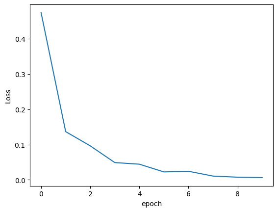
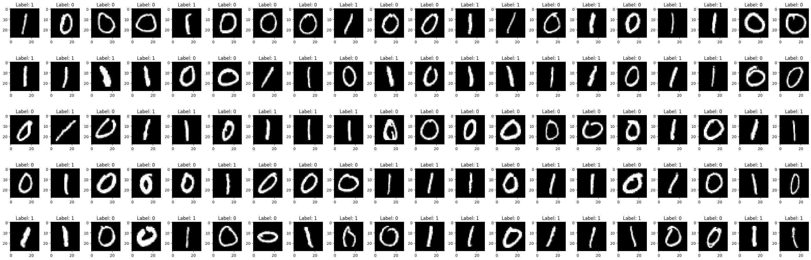

# 🧠 MNIST Handwritten Digit Recognition with CNN

This repository provides a complete LaTeX report and supplementary materials for a machine learning project that implements a **Convolutional Neural Network (CNN)** to classify handwritten digits from the **MNIST dataset**.

---

## 📁 Project Structure

```
├── mnist_report.tex        # Main LaTeX report source
├── output.png              # Training loss plot
├── output2.png             # Grid of MNIST images with labels
├── README.md               # Project description and instructions
```

---

## 📖 Project Description

The MNIST dataset is a benchmark dataset in the field of computer vision and deep learning. It contains 70,000 grayscale images of handwritten digits (60,000 for training and 10,000 for testing), each of size 28x28 pixels.

This project uses a simple yet effective CNN model to classify the digits, and evaluates the model based on training loss and sample predictions.

### 🏗️ Model Architecture

- **Input**: 28x28 grayscale images
- **Conv2D**: 32 filters, 3x3 kernel, ReLU
- **MaxPooling2D**: 2x2 pool size
- **Flatten**
- **Dense**: 128 units, ReLU
- **Dense**: 10 units, Softmax

### 🔍 Training Details

- Optimizer: `Adam`
- Loss Function: `Categorical Cross-Entropy`
- Epochs: 5–10
- Batch Size: 128
- Validation Split: 10%

---

## 📊 Visualizations

### 📉 Training Loss Over Epochs



The plot shows a sharp decrease in training loss, indicating effective learning over the epochs.

### 🔢 Sample MNIST Digits



A grid of sample digits from the dataset, annotated with their true labels.

---

## ⚙️ How to Compile the Report

To generate the PDF version of the report:

1. Ensure all files are in the same directory.
2. Run the following command:

```bash
pdflatex mnist_report.tex
```

This will compile the LaTeX file and generate a well-formatted report including the figures above.

---

## 📦 Requirements

You will need a LaTeX distribution to compile the `.tex` file. Recommended options include:

- [TeX Live](https://www.tug.org/texlive/)
- [MiKTeX](https://miktex.org/)

---

## ✍️ Author

**Mahla Entezari**  
Spring 2024

---

## 💬 License and Contribution

Feel free to fork, reuse, or expand on this project. Contributions and suggestions are always welcome!

